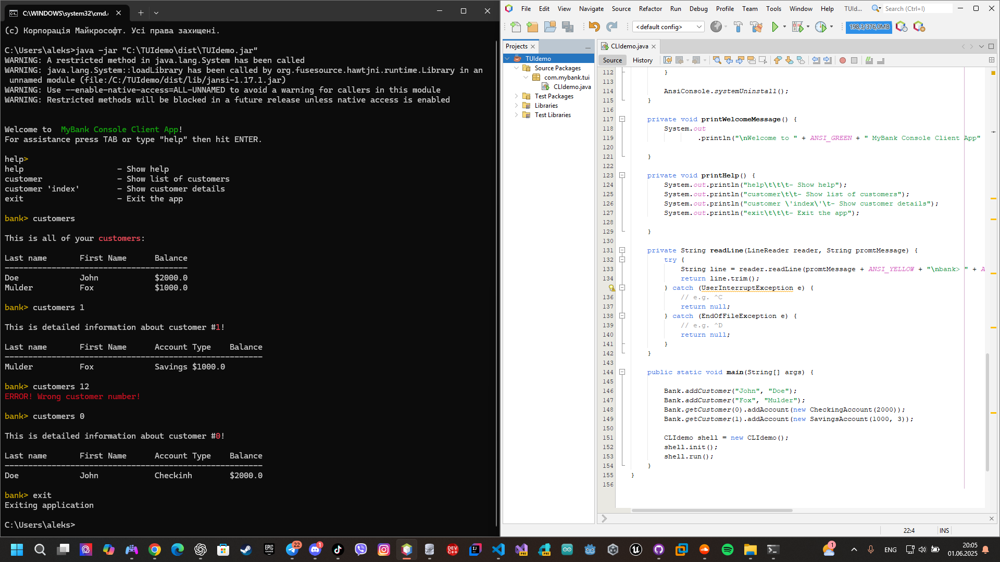

# UI Lab 2 


Це одна з робіт, які доповнюють основний цикл лабораторних робіт #1-8 (проект **Banking**, [Netbeans](https://netbeans.org/)) з ООП.  Основна мета цих додаткових вправ - познайомитись з різними видами інтерфейсів користувача та засобами їх створення. Згадувані 'базові' роботи розміщено в [окремому репозиторії](https://github.com/liketaurus/OOP-JAVA) (якщо будете робити завдання на "4" або "5" раджу переглянути [діаграму класів](https://github.com/liketaurus/OOP-JAVA/blob/master/MyBank.png), аби розуміти які методи є у класів).

В ході першої роботи вам пропонується виконати **наступне завдання** - [Робота 2: CLI з jline 3](https://github.com/ppc-ntu-khpi/TUI-Lab2-Starter/blob/master/Lab%202%20-%20CLI/Lab%202.md)
  
**Додаткове завдання** (для тих хто зробив все і прагне більшого): [дивіться тут](https://github.com/ppc-ntu-khpi/TUI-Lab2-Starter/blob/master/Lab%202%20-%20CLI/Lab%202%20-%20add.md)

Всі необхідні бібліотеки містяться у теці [jars](https://github.com/ppc-ntu-khpi/TUI-Lab2-Starter/tree/master/jars). В тому числі - всі необхідні відкомпільовані класи з робіт 1-8 - файл [MyBank.jar](https://github.com/ppc-ntu-khpi/TUI-Lab2-Starter/blob/master/jars/MyBank.jar). Файл даних лежить у теці [data](https://github.com/ppc-ntu-khpi/TUI-Lab2-Starter/tree/master/data).

---
**УВАГА! Не забуваємо здавати завдання через Google Classroom та вказувати посилання на створений для вас репозиторій!**

Також пам'ятайте, що ніхто не заважає вам редагувати файл README у вашому репозиторії😉.
А ще - дуже раджу спробувати нову фічу - інтеграцію з IDE REPL.it (хоч з таким завданням вона може й не впоратись, однак, цікаво ж!).


 
[](https://gitter.im/PPC-SE-2020/OOP?utm_source=badge&utm_medium=badge&utm_campaign=pr-badge)

## На "трійку"
1. Завантажте необхідні jar-файли - [jline](https://repo1.maven.org/maven2/org/jline/jline/3.10.0/jline-3.10.0.jar), [jansi](http://repo1.maven.org/maven2/org/fusesource/jansi/jansi/1.17.1/jansi-1.17.1.jar), [MyBank](https://github.com/liketaurus/TUI-Labs/blob/master/jars/MyBank.jar). Останній файл містить всі класи (*Bank, Customer, Account* та ін.) з наших попередніх лаб. *УВАГА! Також ви можете взяти всі три файли прямо з [цього ж репозиторію](https://github.com/liketaurus/TUI-Labs/blob/master/jars)*.
2. Створіть в Netbeans новий проект з назвою TUIdemo (або використайте проект, створений в ході виконання попередньої роботи). *УВАГА! Чекбокс *Create Main Class* треба **очистити** (**не створювати виконуваний клас**)!*
3. Додайте до проекту всі завантажені вами бібліотеки - правою кнопкой на проекті, обрати *Properties*, потім у дереві категорій обрати *Libraries* (другий пункт зверху), натиснути у правій частині вікна кнопку *Add JAR/Folder*, обрати jar-файли, завантажені у п. 1, натиснути *Ok*
4. Додайте до проекту файл **[CLIdemo.java](https://github.com/liketaurus/TUI-Labs/blob/master/Lab%202%20-%20CLI/CLIdemo.java)** з цього репозиторію
5. Вивчіть вихідний код у файлі, впевніться, що ви розумієте як він має працювати
6. Відкрийте консоль (під Linux - *емулятор терміналу*, під Windows - *PowerShell*), перейдіть до теки проекту (під Linux - ```cd NetBeansProjects/TUIDemo/dist```, під Windows - ```cd .\Documents\NetBeansProjects\TUIdemo\dist```). Запустіть проект (```java -jar .\TUIdemo.jar```) - ви маєте побачити запрошення (```bank>```). Натисніть **TAB** аби переглянути доступні команди. Натисніть <kbd>h</kbd> <kbd>TAB</kbd> <kbd>ENTER</kbd> аби переглянути довідку, <kbd>cus</kbd> <kbd>TAB</kbd> <kbd>s</kbd> <kbd>ENTER</kbd> аби переглянути список клієнтів банку, <kbd>Up</kbd> <kbd>Backspace</kbd> <kbd>Space</kbd> <kbd>1</kbd> <kbd>ENTER</kbd> аби переглянути інформацію про клієнта з номером 1, <kbd>Up</kbd> <kbd>2</kbd> <kbd>ENTER</kbd> аби впевнитись, що програма коректно обробляє неправильний номер клієнта, <kbd>e</kbd> <kbd>TAB</kbd> <kbd>ENTER</kbd> для виходу.Продемонстрируйте результат викладачеві.



## На "п'ять"
Додайте ще одну команду - report, яка має виводити звіт за клієнтами такого ж виду, як у роботі номер 8 (див. CustomerReport).
Запустіть проект, впевніться, що все працює як очікувалось. Продемонстрируйте результат викладачеві.

```java
package com.mybank.tui;

import com.mybank.domain.Bank;
import com.mybank.domain.CheckingAccount;
import com.mybank.domain.Customer;
import com.mybank.domain.SavingsAccount;
import java.io.PrintWriter;
import java.util.LinkedList;
import java.util.List;

import org.jline.reader.*;
import org.jline.reader.impl.completer.*;
import org.jline.utils.*;
import org.fusesource.jansi.*;

/**
 * Console client for 'Banking' example
 *
 * @author Alexander 'Taurus' Babich
 */
public class CLIdemo {

    public static final String ANSI_RESET = "\u001B[0m";
    public static final String ANSI_BLACK = "\u001B[30m";
    public static final String ANSI_RED = "\u001B[31m";
    public static final String ANSI_GREEN = "\u001B[32m";
    public static final String ANSI_YELLOW = "\u001B[33m";
    public static final String ANSI_BLUE = "\u001B[34m";
    public static final String ANSI_PURPLE = "\u001B[35m";
    public static final String ANSI_CYAN = "\u001B[36m";
    public static final String ANSI_WHITE = "\u001B[37m";

    private String[] commandsList;

    public void init() {
        commandsList = new String[]{"help", "customers", "customer", "report", "exit"};
    }

    public void run() {
        AnsiConsole.systemInstall(); // needed to support ansi on Windows cmd
        printWelcomeMessage();
        LineReaderBuilder readerBuilder = LineReaderBuilder.builder();
        List<Completer> completors = new LinkedList<>();

        completors.add(new StringsCompleter(commandsList));
        readerBuilder.completer(new ArgumentCompleter(completors));

        LineReader reader = readerBuilder.build();

        String line;
        PrintWriter out = new PrintWriter(System.out);

        while ((line = readLine(reader, "")) != null) {
            if ("help".equals(line)) {
                printHelp();
            } else if ("customers".equals(line)) {
                printCustomers();
            } else if (line.indexOf("customer") != -1) {
                printCustomerDetails(line);
            } else if ("report".equals(line)) {
                printReport();
            } else if ("exit".equals(line)) {
                System.out.println("Exiting application");
                return;
            } else {
                System.out.println(ANSI_RED + "Invalid command, For assistance press TAB or type \"help\" then hit ENTER." + ANSI_RESET);
            }
        }

        AnsiConsole.systemUninstall();
    }

    private void printCustomers() {
        AttributedStringBuilder a = new AttributedStringBuilder()
                .append("\nThis is all of your ")
                .append("customers", AttributedStyle.BOLD.foreground(AttributedStyle.RED))
                .append(":");

        System.out.println(a.toAnsi());
        if (Bank.getNumberOfCustomers() > 0) {
            System.out.println("\nLast name\tFirst Name\tBalance");
            System.out.println("---------------------------------------");
            for (int i = 0; i < Bank.getNumberOfCustomers(); i++) {
                System.out.println(Bank.getCustomer(i).getLastName() + "\t\t" + Bank.getCustomer(i).getFirstName() + "\t\t$" + Bank.getCustomer(i).getAccount(0).getBalance());
            }
        } else {
            System.out.println(ANSI_RED + "Your bank has no customers!" + ANSI_RESET);
        }
    }

    private void printCustomerDetails(String line) {
        try {
            int custNo = 0;
            if (line.length() > 8) {
                String strNum = line.split(" ")[1];
                if (strNum != null) {
                    custNo = Integer.parseInt(strNum);
                }
            }
            Customer cust = Bank.getCustomer(custNo);
            String accType = cust.getAccount(0) instanceof CheckingAccount ? "Checking" : "Savings";

            AttributedStringBuilder a = new AttributedStringBuilder()
                    .append("\nThis is detailed information about customer #")
                    .append(Integer.toString(custNo), AttributedStyle.BOLD.foreground(AttributedStyle.RED))
                    .append("!");

            System.out.println(a.toAnsi());

            System.out.println("\nLast name\tFirst Name\tAccount Type\tBalance");
            System.out.println("-------------------------------------------------------");
            System.out.println(cust.getLastName() + "\t\t" + cust.getFirstName() + "\t\t" + accType + "\t$" + cust.getAccount(0).getBalance());
        } catch (Exception e) {
            System.out.println(ANSI_RED + "ERROR! Wrong customer number!" + ANSI_RESET);
        }
    }

    private void printReport() {
        AttributedStringBuilder a = new AttributedStringBuilder()
                .append("\nCustomer Report")
                .append("\n========================");

        System.out.println(a.toAnsi());

        if (Bank.getNumberOfCustomers() == 0) {
            System.out.println(ANSI_RED + "No customers to report!" + ANSI_RESET);
            return;
        }

        double totalBalance = 0;
        double totalChecking = 0;
        double totalSavings = 0;

        System.out.println("Last Name\tFirst Name\tChecking Account\tSavings Account\tTotal Balance");
        System.out.println("---------------------------------------------------------------------------");

        for (int i = 0; i < Bank.getNumberOfCustomers(); i++) {
            Customer cust = Bank.getCustomer(i);
            double checkingBalance = 0;
            double savingsBalance = 0;

            for (int j = 0; j < cust.getNumberOfAccounts(); j++) {
                if (cust.getAccount(j) instanceof CheckingAccount) {
                    checkingBalance += cust.getAccount(j).getBalance();
                } else if (cust.getAccount(j) instanceof SavingsAccount) {
                    savingsBalance += cust.getAccount(j).getBalance();
                }
            }

            double custTotal = checkingBalance + savingsBalance;

            System.out.printf("%s\t\t%s\t\t$%.2f\t\t\t$%.2f\t\t$%.2f\n",
                    cust.getLastName(), cust.getFirstName(),
                    checkingBalance, savingsBalance, custTotal);

            totalChecking += checkingBalance;
            totalSavings += savingsBalance;
            totalBalance += custTotal;
        }

        System.out.println("---------------------------------------------------------------------------");
        System.out.printf("Totals:\t\t\t\t\t$%.2f\t\t\t$%.2f\t\t$%.2f\n",
                totalChecking, totalSavings, totalBalance);
    }

    private void printWelcomeMessage() {
        System.out.println("\nWelcome to " + ANSI_GREEN + " MyBank Console Client App" + ANSI_RESET + "! \nFor assistance press TAB or type \"help\" then hit ENTER.");
    }

    private void printHelp() {
        System.out.println("help\t\t\t- Show help");
        System.out.println("customers\t\t- Show list of customers");
        System.out.println("customer 'index'\t\t- Show customer details");
        System.out.println("report\t\t\t- Show customer report");
        System.out.println("exit\t\t\t- Exit the app");
    }

    private String readLine(LineReader reader, String promtMessage) {
        try {
            String line = reader.readLine(promtMessage + ANSI_YELLOW + "\nbank> " + ANSI_RESET);
            return line.trim();
        } catch (UserInterruptException e) {
            // e.g. ^C
            return null;
        } catch (EndOfFileException e) {
            // e.g. ^D
            return null;
        }
    }

    public static void main(String[] args) {

        Bank.addCustomer("John", "Doe");
        Bank.addCustomer("Fox", "Mulder");
        Bank.getCustomer(0).addAccount(new CheckingAccount(2000));
        Bank.getCustomer(1).addAccount(new SavingsAccount(1000, 3));

        CLIdemo shell = new CLIdemo();
        shell.init();
        shell.run();
    }
}

```
